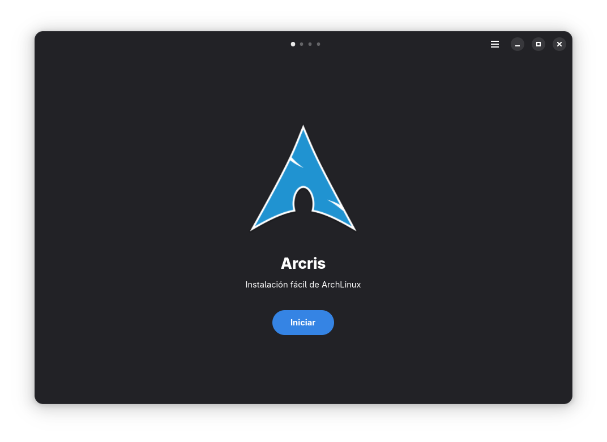

# Arcris 2.0 🚀

<div align="center">
  
  
  **Instalador moderno de Arch Linux con interfaz gráfica**
  
  [](https://www.gnu.org/licenses/gpl-3.0)
  [](https://gtk.org/)
  [](https://gitlab.gnome.org/GNOME/libadwaita)
  [](https://mesonbuild.com/)
</div>

## 📋 Descripción

Arcris 2.0 es un instalador de Arch Linux completamente reescrito con una interfaz moderna y elegante usando GTK4 y Libadwaita. Ofrece una experiencia de instalación intuitiva y automatizada, diseñada para simplificar el proceso de instalación de Arch Linux.

## ✨ Características

- 🎨 **Interfaz moderna** - Diseño elegante con GTK4 y Libadwaita
- 🌍 **Configuración automática** - Detección automática de idioma, zona horaria e internet
- 💾 **Gestión inteligente de discos** - Selección automática con soporte UDisks2
- 🗂️ **Particiones dinámicas** - Visualización ordenada de particiones por disco
- 🔄 **Navegación fluida** - Interfaz tipo carousel con navegación intuitiva
- 🌐 **Soporte multiidioma** - Configuración automática de locales
- ⚡ **Desarrollo ágil** - Script de desarrollo integrado para facilitar contribuciones

## 🛠️ Características Técnicas

- **Frontend**: GTK4 + Libadwaita (C)
- **Build System**: Meson + Ninja
- **Gestión de discos**: UDisks2
- **Detección de hardware**: Automática
- **Configuración de red**: Verificación automática de conectividad

## 📦 Requisitos

### Dependencias de desarrollo

```bash
# Arch Linux / Manjaro
sudo pacman -S meson ninja gtk4 libadwaita-1 udisks2

# Ubuntu / Debian
sudo apt install meson ninja-build libgtk-4-dev libadwaita-1-dev udisks2

# Fedora
sudo dnf install meson ninja-build gtk4-devel libadwaita-devel udisks2
```

### Dependencias de runtime

- GTK4 >= 4.0
- Libadwaita >= 1.2
- UDisks2
- GLib >= 2.66

## 🚀 Instalación

### 1. Clonar el repositorio

```bash
git clone https://github.com/tu-usuario/Arcris2.git
cd Arcris2
```

### 2. Verificar dependencias

```bash
./dev.sh check
```

### 3. Configurar y compilar

```bash
# Opción 1: Usando el script de desarrollo (recomendado)
./dev.sh setup
./dev.sh build

# Opción 2: Usando Meson directamente
meson setup builddir
ninja -C builddir
```

### 4. Ejecutar

```bash
# Usando el script de desarrollo
./dev.sh run

# O directamente
./builddir/src/arcris
```

## 🔧 Script de Desarrollo

Arcris incluye un script de desarrollo completo (`dev.sh`) que facilita el trabajo:

```bash
# Mostrar ayuda
./dev.sh help

# Compilar el proyecto
./dev.sh build

# Ejecutar la aplicación
./dev.sh run

# Ejecutar con información de debug
./dev.sh debug

# Limpiar archivos de compilación
./dev.sh clean

# Compilar y ejecutar automáticamente al cambiar archivos
./dev.sh watch

# Ejecutar tests básicos
./dev.sh test

# Instalar en el sistema
./dev.sh install
```

### Comandos útiles para desarrollo

```bash
# Compilación limpia completa
./dev.sh clean build

# Desarrollo con recarga automática
./dev.sh watch

# Verificar que todo funciona
./dev.sh test run
```

## 🏗️ Estructura del proyecto

```
Arcris2/
├── src/               # Código fuente en C
│   ├── main.c        # Punto de entrada
│   ├── window.c      # Ventana principal
│   ├── page*.c       # Páginas del instalador
│   └── disk_manager.c # Gestión de discos
├── data/             # Recursos y archivos UI
│   ├── *.ui          # Interfaces GTK
│   ├── img/          # Imágenes y assets
│   └── icons/        # Iconos
├── dev.sh            # Script de desarrollo
├── meson.build       # Configuración de build
└── README.md         # Este archivo
```

## 🎯 Flujo de instalación

1. **Página 1**: Bienvenida y verificación de internet
2. **Página 2**: Configuración de idioma, teclado y zona horaria
3. **Página 3**: Selección de disco de instalación
4. **Página 4**: Visualización y configuración de particiones
5. **Página 5**: Instalación y progreso

## 🐛 Desarrollo y Debug

### Logs detallados

```bash
# Ejecutar con logs completos
./dev.sh debug

# O configurar variables manualmente
export G_MESSAGES_DEBUG=all
export GTK_DEBUG=interactive
./builddir/src/arcris
```

### Compilación de desarrollo

```bash
# Reconfigurar para debug
meson setup builddir --buildtype=debug

# O usar el script
./dev.sh reconfigure
```

## 🤝 Contribuir

1. Fork el proyecto
2. Crea una rama para tu feature (`git checkout -b feature/AmazingFeature`)
3. Usa el script de desarrollo: `./dev.sh build test`
4. Commit tus cambios (`git commit -m 'Add some AmazingFeature'`)
5. Push a la rama (`git push origin feature/AmazingFeature`)
6. Abre un Pull Request

### Guidelines de desarrollo

- Usa el script `./dev.sh` para todas las operaciones de build
- Ejecuta `./dev.sh test` antes de hacer commit
- Sigue las convenciones de código GTK/GLib
- Documenta nuevas funcionalidades

## 📸 Capturas de pantalla

| Página de bienvenida | Selección de disco | Particiones |
|---|---|---|
|  | *Próximamente* | *Próximamente* |

## 🐧 Compatibilidad

- **Arch Linux** - Totalmente compatible
- **Manjaro** - Compatible
- **EndeavourOS** - Compatible
- **Otras distribuciones** - En desarrollo

## 📄 Licencia

Este proyecto está licenciado bajo la Licencia GPL v3 - ver el archivo [LICENSE](LICENSE) para más detalles.

## 🙏 Agradecimientos

- [GTK Project](https://gtk.org/) - Por el excelente framework
- [GNOME Libadwaita](https://gitlab.gnome.org/GNOME/libadwaita) - Por los componentes modernos
- [Arch Linux](https://archlinux.org/) - Por la distribución base
- Comunidad de desarrolladores de instaladores de Arch Linux

## 📞 Soporte

- 🐛 **Issues**: [GitHub Issues](https://github.com/tu-usuario/Arcris2/issues)
- 💬 **Discusiones**: [GitHub Discussions](https://github.com/tu-usuario/Arcris2/discussions)
- 📧 **Email**: enproceso@github.com

---

<div align="center">
  <sub>Construido con ❤️ para la comunidad de Arch Linux</sub>
</div>
