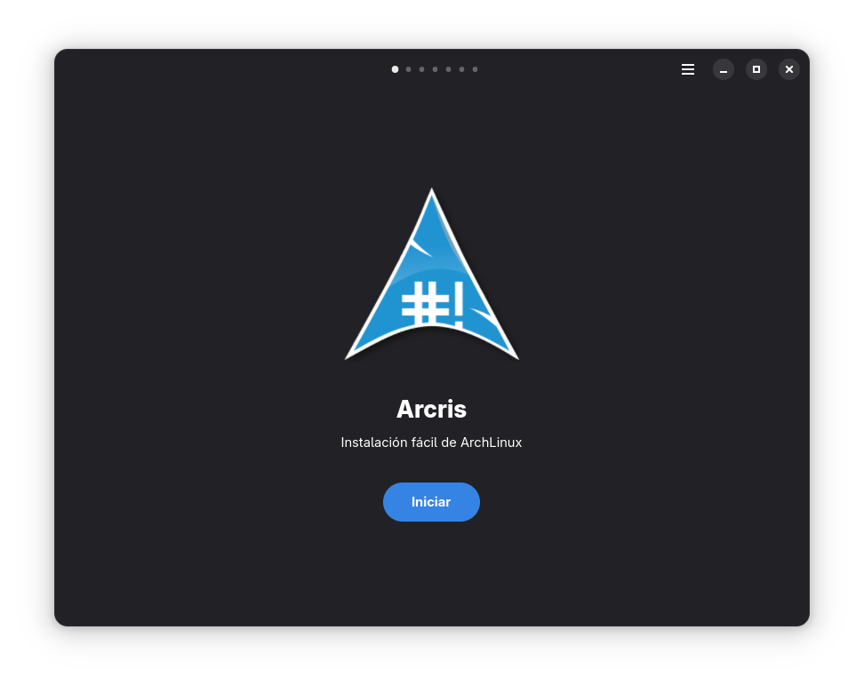
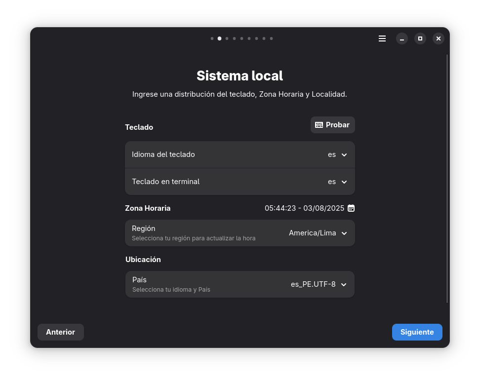
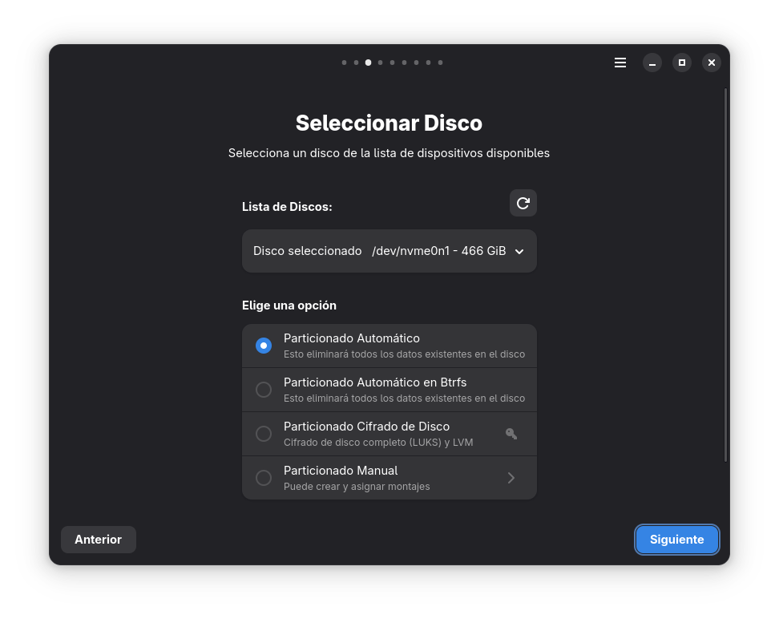
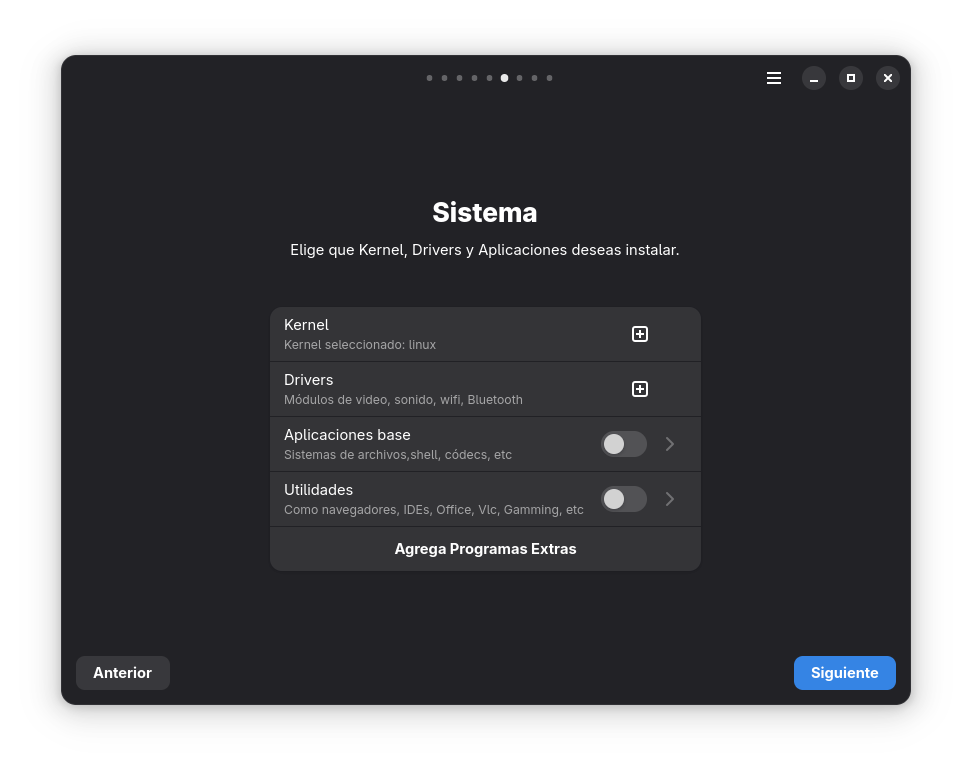
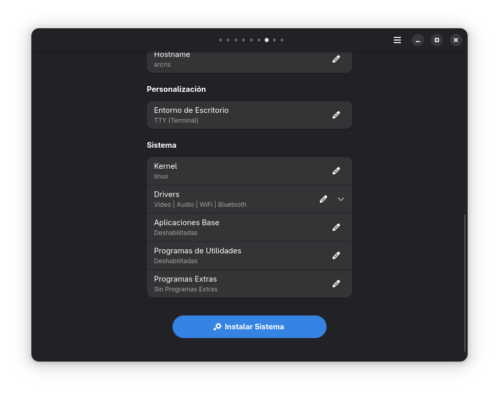
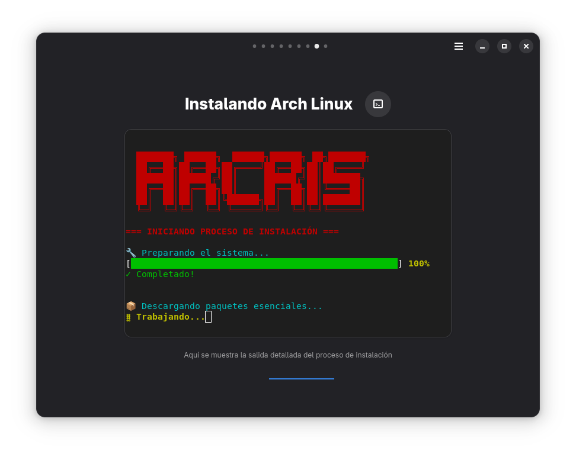
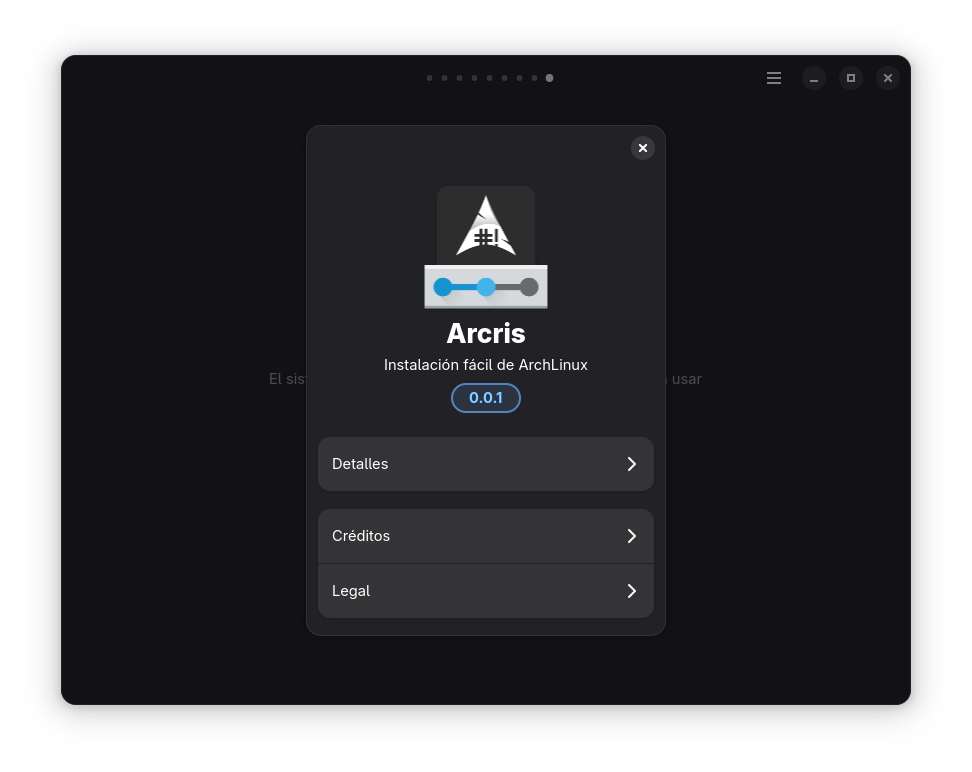

# Arcris 2.0 🚀

<div align="center">
  

  **Instalador moderno de Arch Linux con interfaz gráfica**

  [](https://www.gnu.org/licenses/gpl-3.0)
  [](https://gtk.org/)
  [](https://gitlab.gnome.org/GNOME/libadwaita)
  [](https://archlinux.org/)
</div>

## 📋 Descripción

Arcris 2.0 es un instalador gráfico moderno para Arch Linux, diseñado con GTK4 y Libadwaita. Proporciona una experiencia de instalación intuitiva y automatizada que simplifica significativamente el proceso de instalación de Arch Linux, especialmente para usuarios nuevos o aquellos que prefieren una interfaz gráfica sencilla de instalar.

## ✨ Características Principales

- 🎨 **Interfaz Moderna** - Diseño elegante con GTK4 y Libadwaita siguiendo las pautas de GNOME
- 🖥️ **Detección Automática** - Reconocimiento automático de hardware, idioma y zona horaria
- 💾 **Gestión Inteligente de Discos** - Selección y particionado automático con soporte UDisks2
- 🔧 **Configuración Avanzada** - Opciones para usuarios experimentados y principiantes
- ⚡ **Instalación Rápida** - Proceso de instalación optimizado y eficiente
- 🔒 **Seguridad** - Validación de contraseñas y configuración segura del sistema

## 🛠️ Tecnologías Utilizadas

- **Frontend**: GTK4 + Libadwaita (C)
- **Build System**: Meson + Ninja
- **Gestión de Discos**: UDisks2
- **Detección de Hardware**: Automática
- **Configuración de Red**: NetworkManager
- **Terminal**: VTE4

## 📦 Dependencias

> **Nota**: Este instalador está diseñado exclusivamente para Arch Linux.

### Instalación de Dependencias en Arch Linux

```bash
# Actualizar el sistema
sudo pacman -Syu

# Instalar dependencias principales
sudo pacman -S --needed base-devel meson ninja gtk4 libadwaita udisks2 vte4 glib2 networkmanager

# Instalar tecla (dependencia requerida)
sudo pacman -S tecla

# Dependencias opcionales pero recomendadas
sudo pacman -S --needed git wget curl rsync
```

### Dependencias del Sistema

- **Base**: `base-devel`, `meson`, `ninja`
- **GTK/UI**: `gtk4`, `libadwaita`, `vte4`, `glib2`
- **Disco/Sistema**: `udisks2`, `networkmanager`
- **Requerida**: `tecla`

## 🚀 Instalación y Uso

### 1. Clonar el Repositorio

```bash
git clone https://github.com/tu-usuario/Arcris2.git
cd Arcris2
```

### 2. Compilar el Proyecto

```bash
# Configurar el proyecto con Meson
meson setup builddir

# Compilar con Ninja
ninja -C builddir
```

### 3. Ejecutar Arcris

```bash
# Ejecutar desde el directorio de build
./builddir/src/arcris

# O usar el script de desarrollo
./dev.sh run
```

### 4. Instalación en el Sistema (Opcional)

```bash
# Instalar en el sistema
sudo ninja -C builddir install

# Actualizar cache de iconos
sudo gtk-update-icon-cache -f -t /usr/share/icons/hicolor/

# Actualizar base de datos de aplicaciones
sudo update-desktop-database /usr/share/applications/
```

## 🎯 Guía de Uso

Arcris 2.0 guía al usuario a través de un proceso de instalación paso a paso:

### Página 1: Bienvenida


Verificación inicial del sistema y conectividad a internet.

### Página 2: Configuración del sistema


Selección de idioma, distribución de teclado y zona horaria.

### Página 3: Selección de Disco


Detección automática y selección del disco de instalación.

### Página 4: Configuración de Usuario


Creación de usuario y configuración de contraseñas del sistema.

### Página 5: Entorno de Escritorio


Selección de entorno de escritorio entre tty, DE o WM.

### Página 6: Selección de Software


Opciones avanzadas para usuarios experimentados.

### Página 7: Resumen




### Página 8: Progreso de Instalación


Monitor en tiempo real del proceso de instalación.



Barra de progreso y estado detallado de la instalación.


### Página 9: Finalización


Confirmación de instalación exitosa y opciones post-instalación.

### Página 10: Información extra



## 🔧 Desarrollo

### Script de Desarrollo

```bash
# Mostrar ayuda
./dev.sh help

# Compilar el proyecto
./dev.sh build

# Ejecutar la aplicación
./dev.sh run

# Compilar y ejecutar automáticamente
./dev.sh watch

# Limpiar archivos de compilación
./dev.sh clean

# Ejecutar con información de debug
./dev.sh debug
```

### Estructura del Proyecto

```
Arcris2/
├── src/                    # Código fuente en C
│   ├── main.c             # Punto de entrada
│   ├── window.c           # Ventana principal
│   ├── page*.c            # Páginas del instalador
│   └── disk_manager.c     # Gestión de discos
├── data/                  # Recursos
│   ├── *.ui              # Interfaces GTK
│   ├── img/              # Imágenes y capturas
│   │   └── Capturas/     # Capturas de pantalla
│   └── icons/            # Iconos del sistema
├── dev.sh                # Script de desarrollo
├── meson.build           # Configuración de build
└── README.md             # Documentación
```

## 🐛 Solución de Problemas

### Problemas Comunes

**Error: tecla no encontrado**
```bash
sudo pacman -S tecla
```

**Error de compilación GTK4**
```bash
sudo pacman -S gtk4 libadwaita
```

**Problemas de permisos de disco**
```bash
sudo usermod -a -G storage $USER
# Reiniciar sesión después de este comando
```

**Debug detallado**
```bash
export G_MESSAGES_DEBUG=all
export GTK_DEBUG=interactive
./builddir/src/arcris
```

## 🤝 Contribuir

1. Fork el proyecto
2. Crea una rama para tu característica (`git checkout -b feature/NuevaCaracteristica`)
3. Instala las dependencias: `sudo pacman -S tecla base-devel meson ninja gtk4 libadwaita`
4. Compila y prueba: `./dev.sh build test`
5. Commit tus cambios (`git commit -m 'Agregar nueva característica'`)
6. Push a la rama (`git push origin feature/NuevaCaracteristica`)
7. Abre un Pull Request

### Guías de Desarrollo

- Usa exclusivamente Arch Linux para desarrollo
- Asegúrate de que `tecla` esté instalado antes de compilar
- Ejecuta `./dev.sh test` antes de hacer commit
- Sigue las convenciones de código GTK4/GLib
- Todas las nuevas características deben incluir capturas de pantalla

## 📋 Requisitos del Sistema

- **Distribución**: Arch Linux (exclusivamente)
- **Arquitectura**: x86_64
- **RAM**: Mínimo 2GB (recomendado 4GB)
- **Espacio en disco**: Mínimo 20GB para instalación
- **Conexión a internet**: Requerida para descarga de paquetes

## 📄 Licencia

Este proyecto está licenciado bajo la Licencia GPL v3. Ver el archivo [LICENSE](LICENSE) para más detalles.

## 🙏 Agradecimientos

- [GTK Project](https://gtk.org/) - Framework de interfaz gráfica
- [GNOME Libadwaita](https://gitlab.gnome.org/GNOME/libadwaita) - Componentes modernos de UI
- [Arch Linux](https://archlinux.org/) - La mejor distribución Linux
- Gracias a Ezarcher por las plantillas del ISO LIVE de Arch Linux

## 📞 Soporte y Contacto

- 🐛 **Issues**: [GitHub Issues](https://github.com/tu-usuario/Arcris2/issues)
- 💬 **Discusiones**: [GitHub Discussions](https://github.com/tu-usuario/Arcris2/discussions)
- 📋 **Arch Linux Forum**: [Foro de Arch Linux](https://bbs.archlinux.org/)

---

<div align="center">
  <sub>Construido con ❤️ para la comunidad de Arch Linux</sub>
  <br>
</div>
